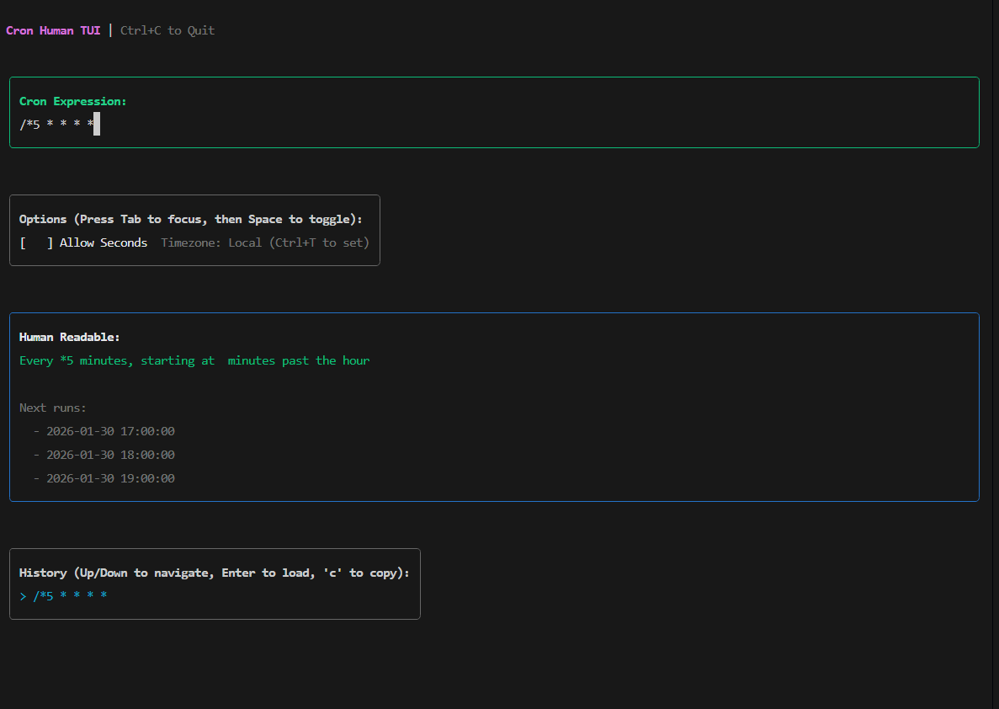

# cron-human-mcp

> MCP server for [cron-human](https://www.npmjs.com/package/cron-human) — system crontab management, schedule analysis, and calendar exports for AI agents.

[](https://www.npmjs.com/package/cron-human-mcp)
[](https://opensource.org/licenses/MIT)



**Requires:** Node.js >= 20

## Setup

Add to `claude_desktop_config.json` (`%APPDATA%\Claude\` on Windows, `~/Library/Application Support/Claude/` on macOS):

```json
{
  "mcpServers": {
    "cron-human": {
      "command": "npx",
      "args": ["cron-human-mcp"]
    }
  }
}
```

## Tools

| Tool | Description |
|------|-------------|
| `explain` | Cron expression to plain English |
| `validate` | Check validity + error details |
| `nextRuns` | Next N fire times |
| `diff` | Compare two expressions side-by-side |
| `stats` | Frequency, gap analysis, cost estimates |
| `crontab_list` | Read & explain all system cron jobs |
| `crontab_add` | Add a cron job to the system |
| `crontab_remove` | Remove jobs matching a pattern |
| `overlaps` | Detect collisions between schedules |
| `export_ical` | Generate .ics calendar file |
| `parse_file` | Parse a crontab file, explain every entry |

## Example Prompts

```
"What does 0 9 * * 1-5 mean?"
"Show me all my cron jobs"
"Add a cron that backs up my DB every night at 2am"
"Will my backup and deploy jobs ever run at the same time?"
"How much will */5 * * * * cost at $0.002 per Lambda?"
"Generate a calendar file for 0 14 * * 1-5 for the next 30 days"
"Parse /etc/crontab and explain everything"
```

## Local Development

```bash
cd cron-human-mcp
npm install
npm run build
node dist/index.js
```

## Platform Notes

Crontab tools (`crontab_list`, `crontab_add`, `crontab_remove`) require Linux/macOS. All other tools work cross-platform.

## License

MIT
